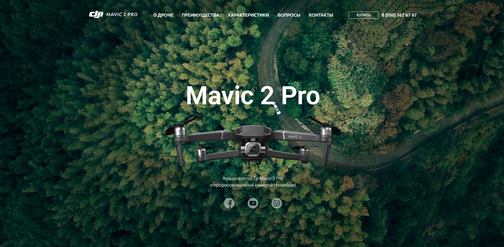
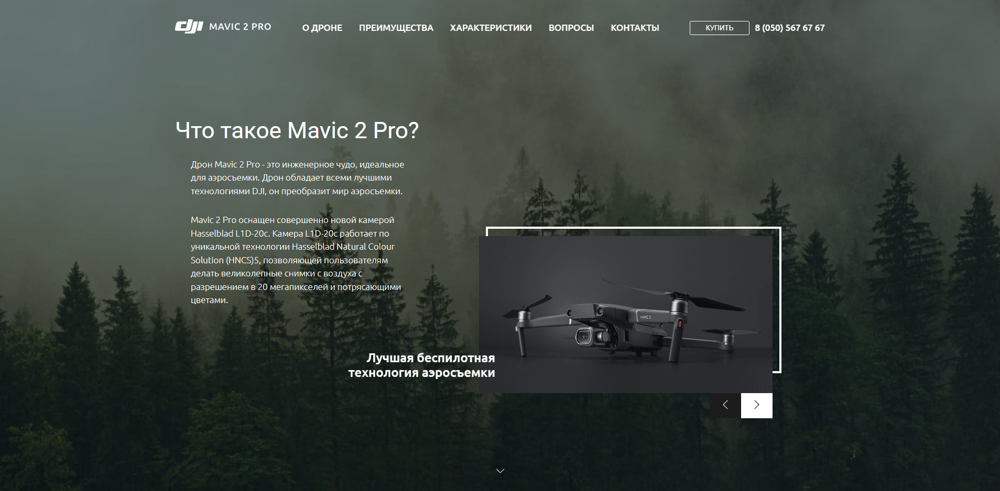
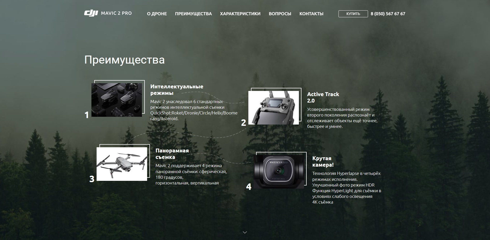
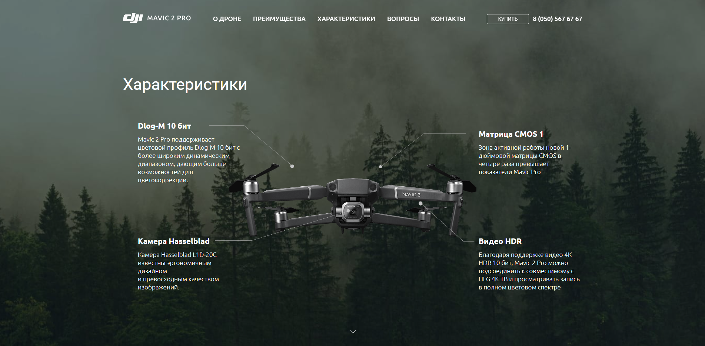
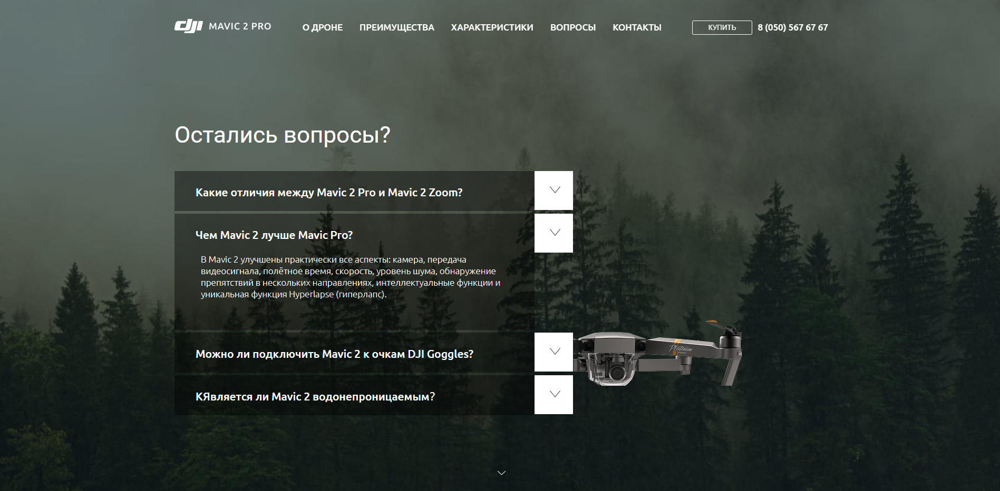
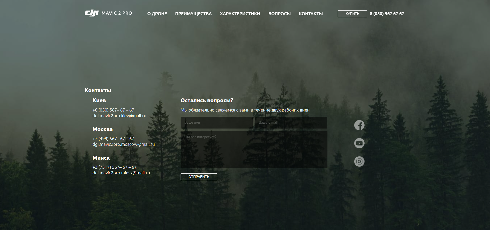

# 🚁 Mavic 2 Pro Landing Page

Современная лендинг-страница для демонстрации дрона **Mavic 2 Pro** с плавной прокруткой, интерактивными элементами 


---

## 🛠️ Технологии

Проект создан с использованием:

- **HTML5**
- **SCSS (Sass)**
- **JavaScript (ES6)**
- **jQuery**
- **Gulp**
- **FullPage.js** — полноэкранная прокрутка
- **Slick Slider** — карусель / слайдер

---

## ⚙️ Функционал

### ✨ Интерактивные элементы

- Аккордеон (секция FAQ)
- Слайдер с кастомными стрелками
- Плавная прокрутка между секциями
- Hover эффекты


### 🎯 Оптимизация

- Минификация HTML / CSS / JS
- Сжатие изображений (Sharp)
- Оптимизация SVG (SVGO)
- Сборка через Gulp

---

## 🧠 Структура проекта


```
Mavic__website-gulp
├─ app
│  ├─ files
│  ├─ fonts
│  │  ├─ sf__pro__display
│  │  │  ├─ SFProDisplay-Regular.woff2
│  │  │  └─ SFProDisplay-Semibold.woff2
│  │  └─ ubuntu
│  │     ├─ Ubuntu-Bold.woff2
│  │     ├─ Ubuntu-Light.woff2
│  │     ├─ Ubuntu-Medium.woff2
│  │     └─ Ubuntu-Regular.woff2
│  ├─ img
│  │  ├─ about
│  │  │  ├─ about__slider-img.png
│  │  │  ├─ about__slider__arrow-left.svg
│  │  │  └─ about__slider__arrow-right.svg
│  │  ├─ advantages
│  │  │  ├─ advantages__line--1.svg
│  │  │  ├─ advantages__line--2.svg
│  │  │  ├─ advantages__line--3.svg
│  │  │  ├─ item__1.jpg
│  │  │  ├─ item__2.jpg
│  │  │  ├─ item__3.jpg
│  │  │  └─ item__4.jpg
│  │  ├─ bg--page.jpg
│  │  ├─ footer
│  │  │  ├─ footer__facebook.svg
│  │  │  ├─ footer__instagram.svg
│  │  │  └─ footer__youtube.svg
│  │  ├─ header
│  │  │  └─ header__logo.svg
│  │  ├─ mobile
│  │  │  ├─ header__clouse-menu__mobile.svg
│  │  │  ├─ header__logo-mobile.svg
│  │  │  └─ header__menu-mobile.svg
│  │  ├─ page--arrow.svg
│  │  ├─ pointer.png
│  │  ├─ preview
│  │  │  ├─ preview__facebook.svg
│  │  │  ├─ preview__instagram.svg
│  │  │  ├─ preview__youtube.svg
│  │  │  ├─ preview___font.jpg
│  │  │  └─ preview___mavic.png
│  │  ├─ questions
│  │  │  ├─ arrow__question.svg
│  │  │  └─ questions__dron.png
│  │  └─ specifications
│  │     ├─ specifications__line-1.svg
│  │     ├─ specifications__line-2.svg
│  │     ├─ specifications__line-3.svg
│  │     ├─ specifications__line-4.svg
│  │     └─ specifications__mavic.png
│  ├─ index.html
│  ├─ js
│  │  └─ main.js
│  └─ scss
│     ├─ style.scss
│     ├─ _fonts.scss
│     ├─ _global.scss
│     ├─ _libs.scss
│     ├─ _media.scss
│     ├─ _mixin.scss
│     ├─ _reset.scss
│     ├─ _slick.scss
│     └─ _vars.scss
├─ build
│  ├─ css
│  │  ├─ fullpage.min.css
│  │  └─ style.min.css
│  ├─ fonts
│  │  ├─ sf__pro__display
│  │  │  ├─ SFProDisplay-Regular.woff2
│  │  │  └─ SFProDisplay-Semibold.woff2
│  │  └─ ubuntu
│  │     ├─ Ubuntu-Bold.woff2
│  │     ├─ Ubuntu-Light.woff2
│  │     ├─ Ubuntu-Medium.woff2
│  │     └─ Ubuntu-Regular.woff2
│  ├─ img
│  │  ├─ about
│  │  │  ├─ about__slider-img.png
│  │  │  ├─ about__slider__arrow-left.svg
│  │  │  └─ about__slider__arrow-right.svg
│  │  ├─ advantages
│  │  │  ├─ advantages__line--1.svg
│  │  │  ├─ advantages__line--2.svg
│  │  │  ├─ advantages__line--3.svg
│  │  │  ├─ item__1.jpg
│  │  │  ├─ item__2.jpg
│  │  │  ├─ item__3.jpg
│  │  │  └─ item__4.jpg
│  │  ├─ bg--page.jpg
│  │  ├─ footer
│  │  │  ├─ footer__facebook.svg
│  │  │  ├─ footer__instagram.svg
│  │  │  └─ footer__youtube.svg
│  │  ├─ header
│  │  │  └─ header__logo.svg
│  │  ├─ mobile
│  │  │  ├─ header__clouse-menu__mobile.svg
│  │  │  ├─ header__logo-mobile.svg
│  │  │  └─ header__menu-mobile.svg
│  │  ├─ page--arrow.svg
│  │  ├─ pointer.png
│  │  ├─ preview
│  │  │  ├─ preview__facebook.svg
│  │  │  ├─ preview__instagram.svg
│  │  │  ├─ preview__youtube.svg
│  │  │  ├─ preview___font.jpg
│  │  │  └─ preview___mavic.png
│  │  ├─ questions
│  │  │  ├─ arrow__question.svg
│  │  │  └─ questions__dron.png
│  │  └─ specifications
│  │     ├─ specifications__line-1.svg
│  │     ├─ specifications__line-2.svg
│  │     ├─ specifications__line-3.svg
│  │     ├─ specifications__line-4.svg
│  │     └─ specifications__mavic.png
│  ├─ index.html
│  └─ js
│     ├─ main.min.js
│     └─ main.min.js.map
├─ gulpfile.js
├─ package-lock.json
└─ package.json

```

## 🔥 Demo







## 👨‍💻 Автор

Виктор Федотов


